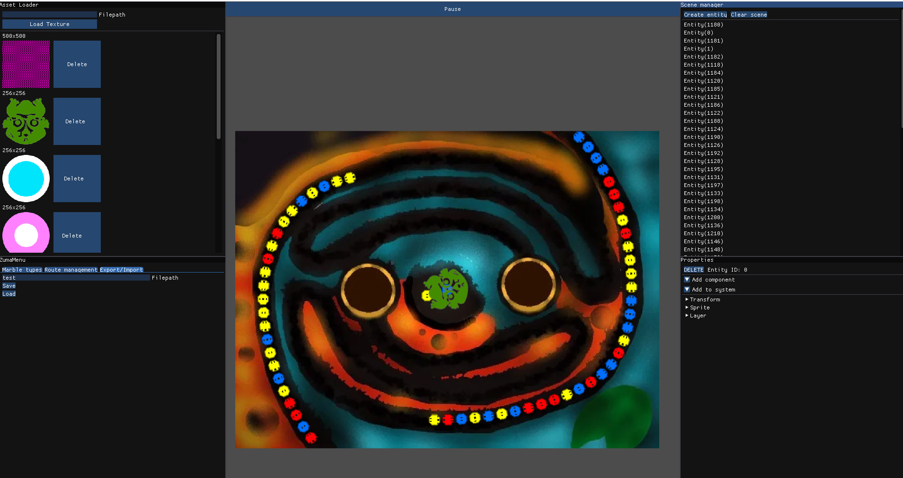

## Description

## Features
- Entity Component System object model
  - Systems for managing animations, particle emitters, movement etc.
- 2D rendering system
  - Batch quad rendering
  - Sprite renderer capable of sampling texture atalases
- Multiplatform capabilities
  - Tested on Android and Windows
- Resource management system
- Event system
- Level editor
- Collision detection system
- Particle emitter
## Technologies used
- OpenGL
- ImGUI
- Nlohmann Json
## Showcase

